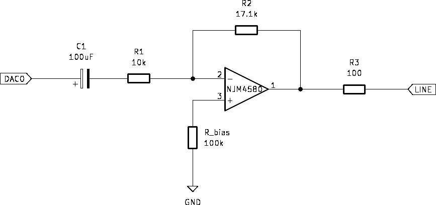

# BareMetalCore

## **Jak engine funguje**

`TC3_Handler() `→`processSample()`→` DAC OUTPUT`

`TC3_Handler()` zajistí přerušení (**44 100× za sekundu)** . `ProcessSample()` potom při každém přerušení z `TC3` zapisuje přímo do `DACC->DACC_CDR`

## **Fázový akumulátor (phase accumulator)**

Klasická DDS technika. Každý hlas má 32-bitový akumulátor, do kterého se přičítá `phaseIncrement`. Horních 11 bitů = index do 2048-prvkové tabulky. Výsledek je extrémně přesná frekvence bez dělení nebo modula.

```
phaseIncrement = (freqHz / 44100) × 2³²
```

## **Wavetables**

- Sinus, Pila, Čtverec, Trojúhelník
- `PMC` — clock gating pro DACC a TC1
- `DACC_MR` — konfigurace DAC bez Arduino HAL
- `TC_CMR` + `TC_RC` — přesná perioda timeru
- `NVIC` — priorita 0 (nejnižší latence)

## DAC výstup

```
  Arduino Due DAC0        Op-amp stage           Line out
(0–3.3 V, DC offset) → [AC coupling + gain] → 2 Vrms / 600 Ω
```

### Úprava na 2 Vrms

Požadované Vrms_out: 2.00 V

DAC výstup = 0 V - 3.3 V

DC offset = 1.65 V

Vpeak_max = 1.65 V

Vrms_DAC = 1.65 / √2 ≈ 1.167 V

Nutné zesílení: 2 / 1.167 ≈ 1.71

Zisk = R2 / R1 = ?k / 10kΩ = 1.71 => ?kΩ = 1.71 × 10kΩ = 17.1kΩ

Zisk = 17.1kΩ / 10kΩ = 1.71

Vrms_out = Vrms_DAC × Zisk = 1.167 × 1.71 = 2

### Schéma

Invertující operační zesilovač s AC vazbou. C1 odstraní DC offset 1.65 V.

fc = 1 / (2π × R1 × C1) = 1 / (2π × 10kΩ × 100µF) ≈ 0.16 Hz

* `C1` = 100 µF/16 V ele.
* `R1` = 10 kΩ
* `R2` = 20 kΩ trim. (nastavit na 17.1 kΩ)
* `R3` = 100 Ω (ochrana výstupu)
* `R_bias` = 100 kΩ (drží kladný vstup op na GND přes AC)
* `JRC 4580 (`Při ±12 V napájení dosáhne výstup ±10 V. Vpeak ≈ 2.83 V (= 2 Vrms × √2) OK.)

  


---

**Poznámky:**

* **Balanced output** : pro studiovou linku dát druhý kanál přes invertor (op-amp s gain = −1) a oba výstupy na XLR konektor.
