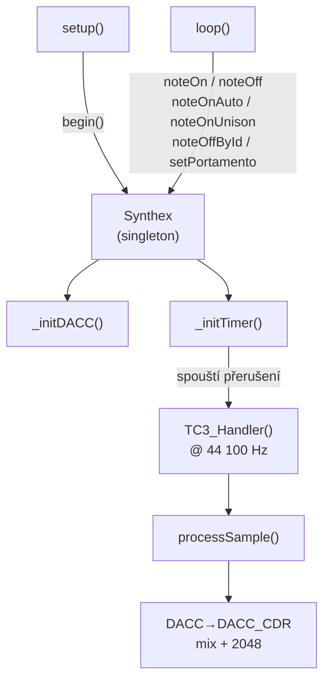
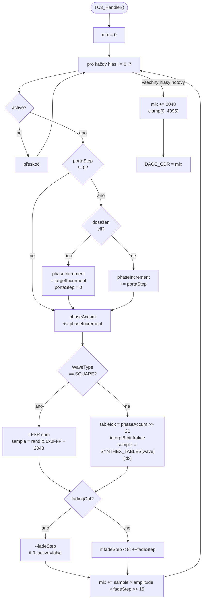

# Synthex

Vícehlasý wavetable syntezátor pro **Arduino Due** (SAM3X8E, 84 MHz ARM Cortex-M3).
Zvuk je generován přímým čtením z Flash paměti bez kopírování do RAM, s výstupem přes 12-bit DAC na pinu **DAC1 (PA3)**.

---

## Obsah

- [Přehled architektury](#přehled-architektury)
- [Hardware](#hardware)
- [Parametry enginu](#parametry-enginu)
- [Wavetables](#wavetables)
- [Fázový akumulátor](#fázový-akumulátor)
- [Portamento](#portamento)
- [Voice stealing](#voice-stealing)
- [Struktura projektu](#struktura-projektu)
- [API reference](#api-reference)
- [Rychlý start](#rychlý-start)
- [Diagnostika paměti](#diagnostika-paměti)
- [Známé chování a limity](#známé-chování-a-limity)

---

## Přehled architektury

### Tok řízení



### Zpracování jednoho vzorku (processSample)



Syntezátor je řízen **přerušením časovače TC3** (TC1/CH0) s frekvencí přesně 44 100 Hz.
V každém přerušení se spočítá jeden vzorek za každý aktivní hlas, výsledky se smíchají a odešlou do DAC.

---

## Hardware

| Parametr | Hodnota |
|---|---|
| Procesor | SAM3X8E (ARM Cortex-M3) |
| Takt | 84 MHz |
| Deska | Arduino Due |
| DAC výstup | `DAC1` — pin PA3 |
| Rozlišení DAC | 12 bit (0–4095) |
| Vzorkovací kmitočet | 44 100 Hz |
| Časovač | TC1 / Channel 0 → TC3_IRQn |
| Prescaler | MCK/2 = 42 MHz → RC = 952 |

---

## Parametry enginu

Definovány v `Synthex.h`:

```cpp
#define SYNTHEX_SAMPLE_RATE     44100u   // vzorkovací kmitočet [Hz]
#define SYNTHEX_VOICES          8u       // počet simultánních hlasů
#define SYNTHEX_DAC_RESOLUTION  12u      // rozlišení DAC [bit]
#define SYNTHEX_DAC_MAX         4095u    // maximum DAC (2^12 - 1)
#define SYNTHEX_DAC_MID         2048u    // DC střed (ticho)
#define SYNTHEX_PHASE_SHIFT     21u      // (32 - 11), horních 11 bitů = index tabulky
#define SYNTHEX_FRAC_SHIFT      13u      // (21 - 8), bits [20:13] pro 8-bit interpolaci
#define SYNTHEX_FADE_STEPS      8u       // anti-click: 8 vzorků ≈ 0,18 ms
#define SYNTHEX_MAX_UNISON      4u       // max hlasů v jednom unison shluku
```

---

## Wavetables

Tabulky jsou generovány skriptem `wav_to_wavetable.py` a uloženy v `wavetables.h` jako `const int16_t[]` — tedy přímo ve **Flash paměti** (`.rodata`). Za běhu se nekopírují do RAM.

| Index | `WaveType` | Popis | Min | Max |
|---|---|---|---|---|
| 0 | `SINE` | Sinus | −2047 | +2047 |
| 1 | `SAW` | Pilový průběh | −2047 | +2045 |
| 2 | `SQUARE` | ⚠ Viz poznámka níže | −2047 | +2047 |
| 3 | `TRIANGLE` | Trojúhelník | −2047 | +2047 |
| 4 | `BANDLIMITED_SAW` | Pilový průběh bez aliasingu | −2292 | +2292 |
| 5 | `SAMPLE` | Uživatelský vzorek (WAV import) | −2048 | +2047 |

Každá tabulka: **2048 vzorků × 2 B = 4 096 B**
Celkem: **6 × 4 096 B = 24 576 B = 24 KB Flash**

> **⚠ `WaveType::SQUARE`** — navzdory názvu engine pro tento typ místo čtení z tabulky generuje **šum pomocí 32-bitového Galoisova LFSR**. Tabulka `SYNTHEX_TABLE_SQUARE` se za běhu nepoužívá. Pokud potřebuješ skutečný obdélník, přidej nový `WaveType` a uprav `processSample()`.

> **⚠ `BANDLIMITED_SAW`** — amplituda přesahuje 12-bit rozsah (peak ±2292, `peak_error=+245`). Po vynásobení amplitudou může dojít k ořezu v DAC výstupu. Při použití doporučujeme snížit `amplitude`.

### Generování vlastní tabulky z WAV souboru

```bash
# Jednoduchý převod, výstup na stdout
python wav_to_wavetable.py sine_A4.wav

# Uložení do souboru, vlastní název pole
python wav_to_wavetable.py kick.wav -o kick_wave.h -n kick_table

# Celý soubor (perkuse), -6 dB headroom
python wav_to_wavetable.py cymbal.wav --full --headroom 6
```

Výstupní formát: `const int16_t <name>[2048u]`, hodnoty v rozsahu [−2048, 2047].

---

## Fázový akumulátor

Syntéza tónu funguje na principu **Direct Digital Synthesis (DDS)**:

```
phaseIncrement = freqHz × (2^32 / sampleRate)
phaseAccum    += phaseIncrement   // přetečení = přirozené zarolování
tableIdx       = phaseAccum >> 21 // horních 11 bitů → 0–2047
frac           = (phaseAccum >> 13) & 0xFF  // 8-bit frakce pro interpolaci
sample         = table[idx] + ((table[idx+1] - table[idx]) * frac) >> 8
```

Přepočet frekvence na inkrement (`freqToIncrement`):

```cpp
constexpr float k = (float)(1ULL << 32) / 44100.0f;  // ≈ 97 391.3
uint32_t inc = (uint32_t)(freqHz * k);
```

Příklady:

| Nota | Frekvence | phaseIncrement (approx.) |
|---|---|---|
| A3 | 220 Hz | 21 226 000 |
| C4 | 261.6 Hz | 25 232 000 |
| A4 | 440 Hz | 42 452 000 |
| A5 | 880 Hz | 84 904 000 |

---

## Portamento

Globální lineární glide frekvence — platí pro všechny hlasy. Při `noteOn()` na aktivní hlas engine místo skoku plynule posunuje `phaseIncrement` o konstantní `portaStep` za každý vzorek.

```cpp
engine.setPortamento(50.0f);    // 50 ms glide
engine.noteOn(0, 220.0f, 350, WaveType::BANDLIMITED_SAW);
engine.noteOn(0, 440.0f, 350, WaveType::BANDLIMITED_SAW);  // plynulý glide 220→440 Hz
engine.setPortamento(0.0f);     // vypnutí
```

Podmínka aktivace glide: hlas musí být **active** a nesmí být **fadingOut**. Jinak se frekvence přepne okamžitě a `phaseAccum` se resetuje (čistý nový tón).

Výpočet `portaStep` v integer aritmetice:

```cpp
int32_t diff    = (int32_t)newInc - (int32_t)v.phaseIncrement;
int32_t samples = (int32_t)(portaTimeMs * (SYNTHEX_SAMPLE_RATE / 1000.0f));
portaStep       = diff / samples;   // min. ±1, pokud diff != 0
```

---

## Voice stealing

Při obsazení všech 8 hlasů `noteOnAuto()` a `noteOnUnison()` automaticky ukradnou hlas podle strategie:


`birthTime` je monotónní čítač inkrementovaný při každém `noteOn`. Nižší hodnota = starší hlas = prioritní pro krádež.

---

## Struktura projektu

```
.
├── Synthex.h              # Třída Synthex, struct Voice, konfigurace, WaveType
├── Synthex.cpp            # Implementace: DAC, Timer, ISR, mix, portamento, unison
├── wavetables.h           # Předgenerované tabulky (Flash), SYNTHEX_TABLES[]
├── main.cpp               # Demo fáze 4: portamento, unison, voice stealing
├── MillisTimer.h          # Neblokovací timer nad millis() (autoReset, drift-free)
├── wav_to_wavetable.py    # Převod WAV → C wavetable (int16, 2048 vzorků)
└── print_memory.py        # PlatformIO post-build skript: výpis Flash/RAM využití
```

---

## API reference

### `Synthex` (singleton)

```cpp
Synthex& engine = Synthex::getInstance();
```

---

#### `begin()`

Inicializuje DACC a časovač TC3. Volat jednou v `setup()`.

```cpp
engine.begin();
```

---

#### `noteOn(voiceIdx, freqHz, amplitude, wave)`

Spustí hlas `voiceIdx` s danou frekvencí, amplitudou a průběhem. Je-li portamento aktivní a hlas právě hraje, spustí se glide místo skoku.

```cpp
engine.noteOn(
    0,                           // index hlasu: 0–7
    440.0f,                      // frekvence [Hz]
    512,                         // amplituda: 0–4095
    WaveType::BANDLIMITED_SAW    // typ průběhu
);
```

> **Bezpečná amplituda pro N souběžných hlasů:** `4095 / N`. Součet hlasů není normalizován automaticky — saturace se ořeže až na výstupu do DAC.

---

#### `noteOnAuto(freqHz, amplitude, wave)` → `uint8_t`

Auto-alokace hlasu s voice stealing. Vrátí index použitého hlasu.

```cpp
uint8_t vi = engine.noteOnAuto(440.0f, 150, WaveType::SINE);
```

---

#### `noteOnUnison(freqHz, unisonVoices, detuneCents, amplitude, wave)` → `uint8_t`

Spustí `unisonVoices` hlasů symetricky rozladěných kolem `freqHz`. Vrátí `noteId` skupiny pro `noteOffById()`.

```cpp
// 3 hlasy: -10 centů, 0, +10 centů
uint8_t id = engine.noteOnUnison(440.0f, 3, 20.0f, 220, WaveType::BANDLIMITED_SAW);
```

| `unisonVoices` | Rozložení v centech (symetrické) |
|---|---|
| 1 | `[0]` |
| 2 | `[-d/2, +d/2]` |
| 3 | `[-d/2, 0, +d/2]` |
| 4 | `[-d/2, -d/6, +d/6, +d/2]` |

Maximum: `SYNTHEX_MAX_UNISON = 4`.

---

#### `noteOff(voiceIdx)`

Spustí fade-out hlasu `voiceIdx`. Hlas se označí jako `fadingOut`; po dojezdu 8 vzorků se `active` nastaví na `false`.

```cpp
engine.noteOff(0);
```

---

#### `noteOffById(noteId)`

Spustí fade-out celé unison skupiny. `noteId` je hodnota vrácená z `noteOnUnison()`. Hodnota `0` je ignorována (rezervováno jako „bez skupiny").

```cpp
engine.noteOffById(id);
```

---

#### `setPortamento(timeMs)` / `getPortamento()`

Nastaví / přečte globální čas portamenta v milisekundách. `0` = okamžitá změna frekvence.

```cpp
engine.setPortamento(50.0f);
float t = engine.getPortamento();   // 50.0
```

---

#### `freqToIncrement(freqHz)` — statická

Převede frekvenci na hodnotu `phaseIncrement`.

```cpp
uint32_t inc = Synthex::freqToIncrement(880.0f);
```

---

#### `getIsrCount()`

Vrátí celkový počet volání ISR od `begin()`.

```cpp
uint32_t count = engine.getIsrCount();
// Očekáváno: count / (millis()/1000.0) ≈ 44100
```

---

### `WaveType` enum

```cpp
enum class WaveType : uint8_t {
    SINE            = 0,
    SAW             = 1,
    SQUARE          = 2,   // ⚠ Generuje šum (LFSR), ne obdélník!
    TRIANGLE        = 3,
    BANDLIMITED_SAW = 4,
    SAMPLE          = 5,
    COUNT           = 6
};
```

---

### `MillisTimer`

Neblokovací timer nad `millis()`. Bezpečný přes přetečení `uint32_t` (wrap ≈ po 49 dnech).

```cpp
// Automatický reset — přesná perioda bez akumulace driftu
MillisTimer blink(500, true);
if (blink.expired()) toggleLed();

// Manuální reset — one-shot
MillisTimer oneShot(2000);
if (oneShot.expired()) { doThing(); oneShot.reset(); }
```

| Metoda | Popis |
|---|---|
| `expired()` | `true` pokud uplynul interval; v autoReset režimu posune referenci o přesně `_interval` |
| `reset()` | Posune referenci na aktuální čas (manuální režim) |
| `remaining()` | Zbývající ms do příštího vypršení |
| `setInterval(ms)` | Dynamická změna intervalu |

---

## Rychlý start

```cpp
#include "Synthex.h"
#include "MillisTimer.h"

Synthex& engine = Synthex::getInstance();

void setup() {
    engine.begin();

    // Jednoduchý tón: A4, hlas 0
    engine.noteOn(0, 440.0f, 512, WaveType::SINE);

    // Unison akord: C4, 3 hlasy, 20 centů spread
    uint8_t id = engine.noteOnUnison(261.6f, 3, 20.0f, 220, WaveType::BANDLIMITED_SAW);
}

void loop() {
    // Sekvencer s MillisTimer...
}
```

---

## Diagnostika paměti

Skript `print_memory.py` se automaticky spustí po buildu jako PlatformIO post-build akce a vypíše využití Flash a RAM:

```
platformio.ini:
    extra_scripts = post:print_memory.py
```

Výstup po buildu:

```
┌─────────────────────────────────────────────┐
│           BareMetalCore — Memory            │
├─────────────────────────────────────────────┤
│ Flash  ████████░░░░░░░░░░░░░░░░░░░░░░  26.3% │
│         134820 / 512000 B  (131 KB / 512 KB) │
│                                             │
│ RAM    ██░░░░░░░░░░░░░░░░░░░░░░░░░░░░   5.1% │
│          5012 / 98304 B    (4 KB / 96 KB)   │
└─────────────────────────────────────────────┘
```

Arduino Due: **512 KB Flash**, **96 KB RAM**.
Wavetables (6 × 4 KB = 24 KB) jsou v `.rodata` → počítají se do Flash, **ne do RAM**.

Výpočet RC pro timer (pro případ změny `SYNTHEX_SAMPLE_RATE`):

```
RC = (MCK / 2) / sampleRate
   = 42 000 000 / 44 100
   ≈ 952
```

Skutečná frekvence: `42 000 000 / 952 ≈ 44 117 Hz` (odchylka < 0,04 %).

---

## Známé chování a limity

| Téma | Popis |
|---|---|
| `WaveType::SQUARE` | Generuje šum (32-bit Galoisův LFSR), ne obdélník. `SYNTHEX_TABLE_SQUARE` se za běhu nepoužívá. |
| `BANDLIMITED_SAW` | Peak ±2292 překračuje 12-bit rozsah (`peak_error=+245`). Při plné amplitudě dochází k ořezu. |
| Mix clipping | Součet hlasů není normalizován. Bezpečná amplituda pro N hlasů: `4095 / N`. Overflow check: `8 hlasů × 2292 × 4095 × 8 ≈ 600 M < INT32_MAX` ✓ |
| Portamento | Platí globálně pro všechny hlasy. `portaStep` je integer — při velmi malém frekvenčním skoku zaokrouhlení na ±1. |
| Voice stealing | `_findFreeVoice()` čte `volatile` data mimo ISR → krátký window neurčitosti je akceptovatelný. |
| Thread safety | `noteOn` / `noteOff` / `noteOffById` chrání kritické sekce pomocí `__disable_irq()` / `__enable_irq()`. |
| `_nextNoteId` | Rotuje 1–255; při 255 notách bez restartu může dojít ke kolizi ID — v praxi zanedbatelné. |
| Flash vs RAM | Tabulky jsou v `.rodata` (Flash). Na AVR by bylo nutné `PROGMEM` + `pgm_read_word()`. Na SAM3X8E stačí `const`. |