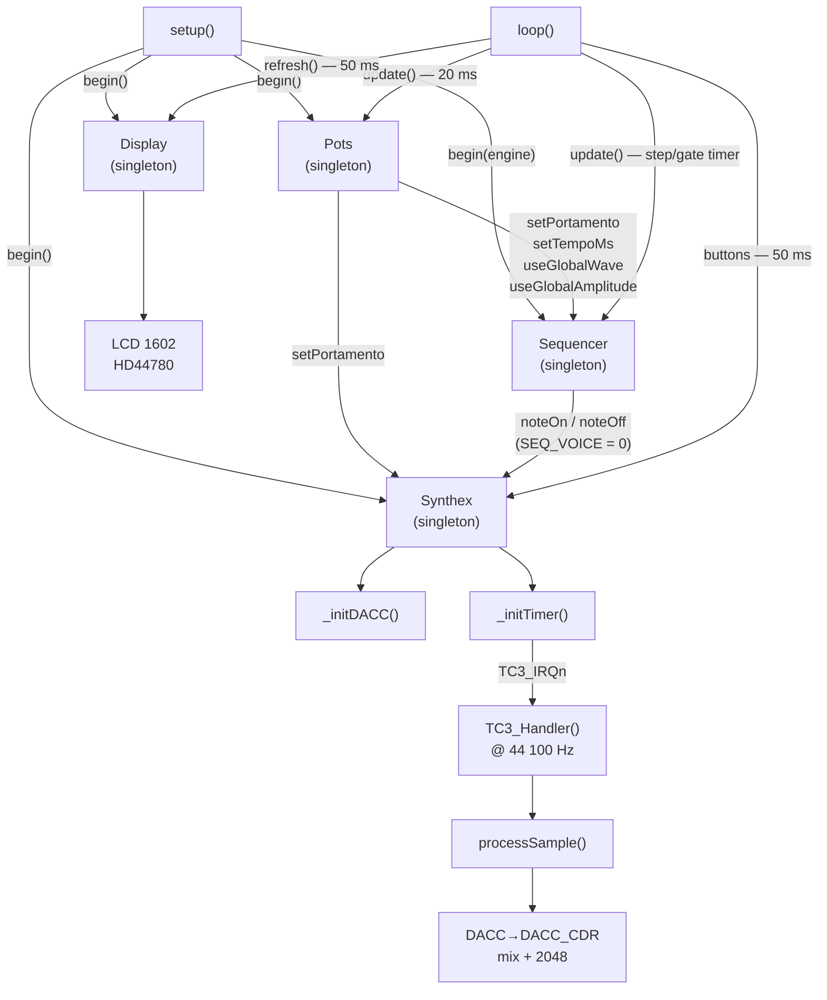
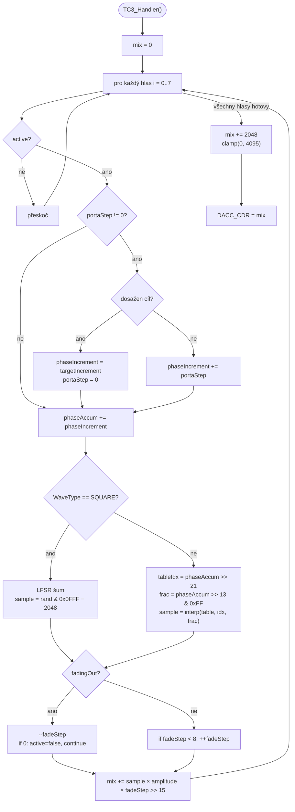
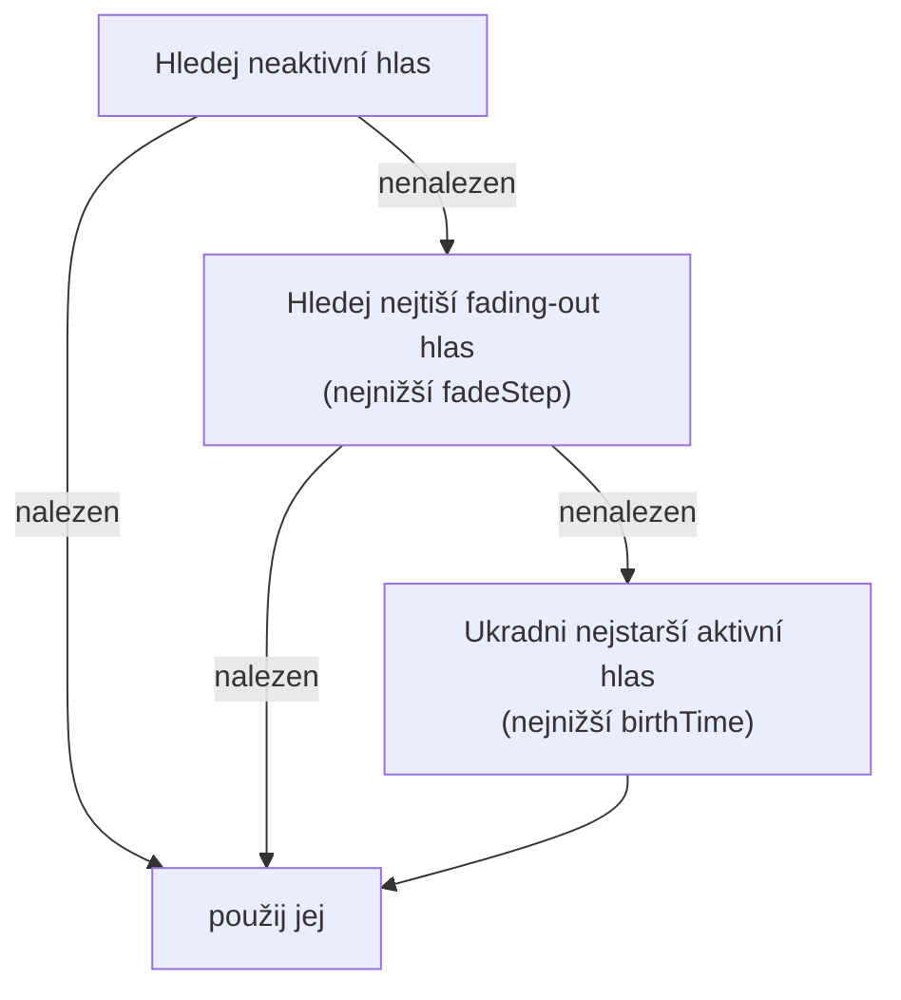

# Synthex

Vícehlasý wavetable syntezátor pro **Arduino Due** (SAM3X8E, 84 MHz ARM Cortex-M3).
Zvuk je generován přímým čtením z Flash paměti bez kopírování do RAM, s výstupem přes 12-bit DAC na pinu  **DAC1 (PA3)** .

Projekt zahrnuje kompletní systém: syntetizátor, step sekvencer, displej LCD 1602 a řízení přes potenciometry.

---

## Obsah

* [Přehled architektury](#p%C5%99ehled-architektury)
* [Hardware](#hardware)
* [Parametry enginu](#parametry-enginu)
* [Wavetables](#wavetables)
* [Fázový akumulátor](#f%C3%A1zov%C3%BD-akumul%C3%A1tor)
* [Portamento](#portamento)
* [Voice stealing](#voice-stealing)
* [Sekvencer](#sekvencer)
* [Potenciometry (Pots)](#potenciometry-pots)
* [Displej (Display)](#displej-display)
* [Hudební stupnice (Scales)](#hudebn%C3%AD-stupnice-scales)
* [Struktura projektu](#struktura-projektu)
* [API reference](#api-reference)
* [Rychlý start](#rychl%C3%BD-start)
* [Diagnostika](#diagnostika)
* [Známé chování a limity](#zn%C3%A1m%C3%A9-chov%C3%A1n%C3%AD-a-limity)

---

## Přehled architektury

### Tok řízení



### Zpracování jednoho vzorku (processSample)



Syntezátor je řízen **přerušením časovače TC3** (TC1/CH0) s frekvencí přesně 44 100 Hz.
V každém přerušení se spočítá jeden vzorek za každý aktivní hlas, výsledky se smíchají a odešlou do DAC.

---

## Hardware

### Arduino Due — pinout

| Komponenta              | Pin           | Poznámka                              |
| ----------------------- | ------------- | -------------------------------------- |
| DAC výstup             | `DAC1`(PA3) | audio výstup, 12-bit                  |
| Potenciometr VOLUME     | `A0`        | 10 kΩ lin., napájení 3,3 V          |
| Potenciometr PORTAMENTO | `A1`        |                                        |
| Potenciometr WAVETYPE   | `A2`        |                                        |
| Potenciometr TEMPO      | `A3`        |                                        |
| LCD RS                  | `8`         | HD44780, 4-bitový mód                |
| LCD EN                  | `9`         |                                        |
| LCD D4                  | `4`         |                                        |
| LCD D5                  | `5`         |                                        |
| LCD D6                  | `6`         |                                        |
| LCD D7                  | `7`         | (pin 13 = LED → záměrně vynechán) |
| Tlačítko PLAY/PAUSE   | `10`        | INPUT_PULLUP, stisk = LOW              |
| Tlačítko STOP         | `11`        |                                        |
| Tlačítko PATTERN+     | `12`        |                                        |

> **⚠ Arduino Due:** logická úroveň 3,3 V. Potenciometry a LCD připojuj výhradně na 3,3 V — ADC není 5 V tolerantní.

### Parametry procesoru

| Parametr              | Hodnota                     |
| --------------------- | --------------------------- |
| Procesor              | SAM3X8E (ARM Cortex-M3)     |
| Takt                  | 84 MHz                      |
| Flash                 | 512 KB                      |
| RAM (SRAM)            | 96 KB                       |
| DAC rozlišení       | 12 bit (0–4095)            |
| Vzorkovací kmitočet | 44 100 Hz                   |
| Časovač             | TC1 / Channel 0 → TC3_IRQn |
| Prescaler             | MCK/2 = 42 MHz → RC = 952  |

---

## Parametry enginu

Definovány v `Synthex.h`:

```cpp
#define SYNTHEX_SAMPLE_RATE     44100u   // vzorkovací kmitočet [Hz]
#define SYNTHEX_VOICES          8u       // počet simultánních hlasů
#define SYNTHEX_DAC_RESOLUTION  12u      // rozlišení DAC [bit]
#define SYNTHEX_DAC_MAX         4095u    // maximum DAC (2^12 - 1)
#define SYNTHEX_DAC_MID         2048u    // DC střed (ticho)
#define SYNTHEX_PHASE_SHIFT     21u      // (32 - 11), horních 11 bitů = index tabulky
#define SYNTHEX_FRAC_SHIFT      13u      // (21 - 8), bits [20:13] pro 8-bit interpolaci
#define SYNTHEX_FADE_STEPS      8u       // anti-click: 8 vzorků ≈ 0,18 ms
#define SYNTHEX_MAX_UNISON      4u       // max hlasů v jednom unison shluku
```

---

## Wavetables

Tabulky jsou generovány skriptem `generate_wavetables.py` a uloženy v `wavetables.h` jako `const int16_t[]` — ve **Flash paměti** (`.rodata`). Za běhu se nekopírují do RAM.

```cpp
#define SYNTHEX_WAVETABLE_SIZE   2048u
#define SYNTHEX_WAVETABLE_COUNT  6u
```

| Index | `WaveType`        | Popis                             | Min    | Max   |
| ----- | ------------------- | --------------------------------- | ------ | ----- |
| 0     | `SINE`            | Sinus                             | −2047 | +2047 |
| 1     | `SAW`             | Pilový průběh                  | −2047 | +2045 |
| 2     | `SQUARE`          | ⚠ Viz poznámka níže           | −2047 | +2047 |
| 3     | `TRIANGLE`        | Trojúhelník                     | −2047 | +2047 |
| 4     | `BANDLIMITED_SAW` | Pilový průběh bez aliasingu    | −2292 | +2292 |
| 5     | `SAMPLE`          | Uživatelský vzorek (WAV import) | −2048 | +2047 |

Každá tabulka: **2048 vzorků × 2 B = 4 096 B**
Celkem: **6 × 4 096 B = 24 576 B = 24 KB Flash**

> **⚠ `WaveType::SQUARE`** — navzdory názvu engine pro tento typ místo čtení z tabulky generuje  **bílý šum pomocí 32-bitového Galoisova LFSR** . Tabulka `SYNTHEX_TABLE_SQUARE` se za běhu nepoužívá. Pokud potřebuješ skutečný obdélník, přidej nový `WaveType` a uprav `processSample()`.

> **⚠ `BANDLIMITED_SAW`** — peak ±2292 překračuje 12-bit rozsah. Po vynásobení amplitudou může dojít k ořezu. Při použití doporučujeme snížit `amplitude`.

> **⚠ Komentář v `wavetables.h`** — hlavičkový komentář souboru uvádí "5 tabulek", ale `SYNTHEX_WAVETABLE_COUNT = 6` a `WaveType::COUNT = 6`. Komentář je zastaralý — přidání `SAMPLE` tabulky ho neaktualizovalo.

---

## Fázový akumulátor

Syntéza tónu funguje na principu **Direct Digital Synthesis (DDS)** s lineární interpolací:

```
phaseIncrement = freqHz × (2^32 / sampleRate)
phaseAccum    += phaseIncrement   // přetečení = přirozené zarolování
tableIdx       = phaseAccum >> 21 // horních 11 bitů → 0–2047
frac           = (phaseAccum >> 13) & 0xFF  // 8-bit frakce
sample         = s0 + ((s1 - s0) * frac) >> 8
```

Přepočet frekvence na inkrement:

```cpp
constexpr float k = (float)(1ULL << 32) / 44100.0f;  // ≈ 97 391.3
uint32_t inc = (uint32_t)(freqHz * k);
```

| Nota | Frekvence | phaseIncrement (approx.) |
| ---- | --------- | ------------------------ |
| A3   | 220 Hz    | 21 226 000               |
| C4   | 261.6 Hz  | 25 232 000               |
| A4   | 440 Hz    | 42 452 000               |
| A5   | 880 Hz    | 84 904 000               |

---

## Portamento

Globální lineární glide — platí pro všechny hlasy. Při `noteOn()` na **aktivní, nefadující** hlas engine plynule posunuje `phaseIncrement` místo skoku.

```cpp
engine.setPortamento(50.0f);    // 50 ms glide
engine.noteOn(0, 220.0f, 350, WaveType::BANDLIMITED_SAW);
engine.noteOn(0, 440.0f, 350, WaveType::BANDLIMITED_SAW);  // plynulý glide 220→440 Hz
engine.setPortamento(0.0f);     // vypnutí
```

Výpočet `portaStep` (integer aritmetika, žádný float v ISR):

```cpp
int32_t diff    = (int32_t)newInc - (int32_t)v.phaseIncrement;
int32_t samples = (int32_t)(portaTimeMs * (SYNTHEX_SAMPLE_RATE / 1000.0f));
portaStep       = diff / samples;   // min. ±1, pokud diff != 0
```

Záporný `portaStep` se přičítá přes unsigned wrap (two's complement): `phaseIncrement += (uint32_t)portaStep`.

---

## Voice stealing

Při plné polyfónii (8 hlasů) funkce `_findFreeVoice()` vybere hlas podle strategie:



`birthTime` je monotónní čítač inkrementovaný při každém `noteOn`. Nižší hodnota = starší = prioritní pro krádež.

---

## Sekvencer

16-krokový step sekvencer (`Sequencer.h / Sequencer.cpp`) s podporou 4 patternů.

### Časování kroků

```
_stepTimer (autoReset=true)  → každých tempoMs přejdi na další krok
_gateTimer (autoReset=false) → po gateMs zavolej noteOff
```

Tok jednoho kroku:

1. `_stepTimer.expired()` → `_triggerStep()` → `noteOn(SEQ_VOICE, ...)` + nastaví `_gateTimer`
2. `_gateTimer.expired()` → `_gateOff()` → `noteOff(SEQ_VOICE)`

### Hlas sekvenceru

Sekvencer pevně používá hlas  **`SEQ_VOICE = 0`** . Hlasy 1–7 jsou volné pro manuální API (`noteOnAuto`, `noteOnUnison`).

### BPM konvence

Každý krok = 1/16 noty v 4/4 taktu. BPM = 15 000 / tempoMs.

| `tempoMs` | BPM |
| ----------- | --- |
| 80 ms       | 187 |
| 125 ms      | 120 |
| 187 ms      | 80  |
| 250 ms      | 60  |
| 500 ms      | 30  |

### Gate

Hodnota 5–95 % kroku, po kterou nota zní. 100 % = legato (noteOff těsně před dalším noteOn).

```
gateMs = tempoMs × gatePercent / 100   (min. 10 ms)
```

### Demo patterny (`loadDemoPatterns()`)

Voláno automaticky z `begin()`.

| Pattern | Kořen | Stupnice           | Charakter                 |
| ------- | ------ | ------------------ | ------------------------- |
| 0       | A3     | Pentatonická moll | Blues/funk groove         |
| 1       | D4     | Dórská           | Jazzový vzestup + sestup |
| 2       | C4     | Bluesová          | Synkopy + blue note F#4   |
| 3       | —     | Prázdný          | Pro live editaci          |

### Globální přepisy (ovládané z Pots)

```cpp
seq.useGlobalWave(true, WaveType::SAW);   // všechny kroky hrají SAW
seq.useGlobalAmplitude(true, 400u);       // všechny kroky na amplitudu 400
seq.setTempoMs(125u);                     // 120 BPM
```

---

## Potenciometry (Pots)

Čtyři 10 kΩ lineární potenciometry na analogových vstupech Due (3,3 V). Čtení pomocí 12-bit ADC s EMA filtrací a deadzónou.

| Pin | Parametr                | Rozsah                                                            |
| --- | ----------------------- | ----------------------------------------------------------------- |
| A0  | Amplitude (volume)      | 0–4095                                                           |
| A1  | Portamento (glide čas) | 0–500 ms (spodních ~6 % = vypnuto)                              |
| A2  | WaveType                | 6 zón: SINE / SAW / SQUARE / TRIANGLE / BANDLIMITED_SAW / SAMPLE |
| A3  | Tempo (ms/krok)         | 500–80 ms (CW = rychleji)                                        |

### EMA filtr

```cpp
smoothed = (prev * 15 + raw) >> 4   // alpha = 1/16, časová konst. ≈ 300 ms
```

### Deadzóna

Parametr se přepočítá pouze pokud `|smoothed - last| > POTS_DEADZONE (16)`. Zabraňuje chvění při mechanickém šumu potenciometru.

### Polling interval

ADC se čte každých **20 ms** (z `loop()`). `analogRead()` na Due trvá ~40 µs — 4 kanály × 160 µs by v těsné smyčce zbytečně zatěžovaly CPU.

---

## Displej (Display)

HD44780 LCD 1602 (16×2 znaků) v 4-bitovém módu. Ovládáno přes `LiquidCrystal` (Arduino core, bez externích závislostí).

### Rozložení obrazovky

```
Řádek 0 — STEP GRID (1 znak / krok):
  col: 0  1  2  3  4  5  6  7  8  9 10 11 12 13 14 15
       █  _  █  █  ▣  .  _  █  █  .  .  █  _  █  █  .
                    ^
                    aktuální krok = CGRAM rámeček

Řádek 1 — INFO:  ">120 A#3 BSAW P2"
  [st][BPM]_[NOTE]_[WAVE]_P[pat]
```

### Klíč symbolů (CGRAM)

| Slot        | Symbol                    | Použití                              |
| ----------- | ------------------------- | -------------------------------------- |
| 0           | `▣`rámeček s tečkou | aktuální krok + nota (gate zapnutý) |
| 1           | `□`prázdný rámeček | aktuální krok + pauza / neaktivní   |
| 2           | `█`plný blok          | krok s notou                           |
| 3           | `_`spodní čára       | krok s pauzou (rest)                   |
| ASCII `.` | tečka                    | neaktivní krok                        |

### Info řádek — formát

```
">120 A#3 BSAW P2"
 ^   ^    ^    ^^
 |   |    |    |└─ číslo patternu (1–4)
 |   |    |    └── "P"
 |   |    └─────── typ vlny (4 znaky): SINE SAW  SQRE TRI  BSAW SMPL
 |   └──────────── nota aktuálního kroku (3 znaky): A#3, C4 , ---
 └──────────────── stav transportu: > hraje | pauza . stop
```

### Timing

`refresh()` trvá ~1,5 ms (oba řádky, 32 znaků). Voláno každých **50 ms** (20 Hz). `lcd.clear()` se v `refresh()` **nikdy** nepoužívá — přepisujeme každý znak na místě.

---

## Hudební stupnice (Scales)

`Scales.h` — konstanty, funkce a předdefinované tabulky pro práci s hudebními stupnicemi.

### Klíčové funkce

```cpp
// MIDI číslo → frekvence [Hz]
float noteFreq(uint8_t midiNote);   // NIKDY nevolej z ISR (powf)

// Sestaví MIDI číslo z semitónu a oktávy
NOTE(semitone, octave)   // makro: NOTE(A, 4) = 69

// Naplní pole frekvencí podle vzoru stupnice
uint8_t buildScale(uint8_t rootMidi, const ScalePattern& pattern,
                   float* outFreqs, uint8_t octaves = 1u);
```

### Semitóny

```cpp
C=0  Cs=1  D=2  Ds=3  E=4  F=5  Fs=6  G=7  Gs=8  A=9  As=10  B=11
// aliasy: Db=1  Eb=3  Gb=6  Ab=8  Bb=10
```

### Dostupné vzory stupnic

| Konstanta                  | Délka | Charakter                            |
| -------------------------- | ------ | ------------------------------------ |
| `SCALE_CHROMATIC`        | 12     | Všech 12 půltónů                 |
| `SCALE_MAJOR`            | 7      | Dur (ionická)                       |
| `SCALE_NATURAL_MINOR`    | 7      | Přirozená moll (aiolská)          |
| `SCALE_HARMONIC_MINOR`   | 7      | Harmonická moll                     |
| `SCALE_PENTATONIC_MAJOR` | 5      | Pentatonická dur                    |
| `SCALE_PENTATONIC_MINOR` | 5      | Pentatonická moll                   |
| `SCALE_BLUES`            | 6      | Bluesová (pentat. moll + blue note) |
| `SCALE_DORIAN`           | 7      | Dórská (jazz/funk)                 |
| `SCALE_PHRYGIAN`         | 7      | Frygická (flamenco)                 |
| `SCALE_LYDIAN`           | 7      | Lydická                             |
| `SCALE_MIXOLYDIAN`       | 7      | Mixolydická (rock/folk)             |
| `SCALE_WHOLE_TONE`       | 6      | Celotónová (Debussy)               |
| `SCALE_DIMINISHED`       | 8      | Zmenšená (jazz)                    |
| `SCALE_INSEN`            | 5      | Japonská insen                      |
| `SCALE_DOUBLE_HARMONIC`  | 7      | Arabská / double harmonická        |

### Předdefinované frekvenční tabulky (Flash)

```cpp
SCALE_C4_MAJOR[7]              // C dur
SCALE_A3_NATURAL_MINOR[7]      // A přirozená moll
SCALE_C4_PENTATONIC_MAJOR[5]   // C pentatonická dur
SCALE_A3_PENTATONIC_MINOR[5]   // A pentatonická moll
SCALE_A3_BLUES[6]              // A blues
SCALE_D4_DORIAN[7]             // D dórská
SCALE_E3_PHRYGIAN[7]           // E frygická
SCALE_C4_WHOLE_TONE[6]         // C celotónová
SCALE_C3_CHROMATIC[12]         // C chromatická
```

### Akordová makra

```cpp
uint8_t chord[3] = CHORD_MAJOR_MIDI(NOTE(G, 3));  // G dur: G3, B3, D4
uint8_t ch2[4]   = CHORD_DOM7_MIDI(NOTE(C, 4));   // C7: C4, E4, G4, Bb4
```

---

## Struktura projektu

```
.
├── Synthex.h              # Třída Synthex, struct Voice, WaveType, konfigurace
├── Syntex.cpp             # Implementace: DAC, Timer, ISR, mix, portamento, unison
├── wavetables.h           # Předgenerované tabulky (Flash), SYNTHEX_TABLES[6][2048]
├── Sequencer.h            # 16-krokový step sekvencer, SeqStep, SeqState
├── Sequencer.cpp          # Implementace: step/gate timer, demo patterny, transport
├── Scales.h               # MIDI → Hz, stupnice, akordy, frekvenční tabulky (Flash)
├── Display.h              # HD44780 LCD 1602 driver, CGRAM symboly
├── Display.cpp            # Implementace: step grid, info řádek, CGRAM vzory
├── Pots.h                 # Čtení 4 potenciometrů, EMA, deadzone, mapování
├── Pots.cpp               # Implementace: analogRead, _remap()
├── MillisTimer.h          # Neblokovací timer nad millis() (autoReset, drift-free)
├── main.cpp               # setup() a loop(): propojení všech komponent
└── generate_wavetables.py # Generátor wavetable tabulek (není součástí buildu)
```

> **Poznámka:** Soubor implementace enginu se jmenuje `Syntex.cpp` (chybí `h`) — jde o překlep v názvu souboru; třída i hlavičkový soubor se správně jmenují `Synthex`.

---

## API reference

### `Synthex` (singleton)

```cpp
Synthex& engine = Synthex::getInstance();
```

#### `begin()`

Inicializuje DACC a časovač TC3. Volat jednou v `setup()`.

#### `noteOn(voiceIdx, freqHz, amplitude, wave)`

Spustí hlas `voiceIdx`. Je-li portamento aktivní a hlas hraje, spustí glide místo skoku.

```cpp
engine.noteOn(0, 440.0f, 512, WaveType::BANDLIMITED_SAW);
// voiceIdx: 0–7 | amplitude: 0–4095
```

#### `noteOnAuto(freqHz, amplitude, wave)` → `uint8_t`

Auto-alokace s voice stealing. Vrátí index hlasu.

#### `noteOnUnison(freqHz, unisonVoices, detuneCents, amplitude, wave)` → `uint8_t`

`unisonVoices` hlasů symetricky rozladěných kolem `freqHz`. Vrátí `noteId` pro `noteOffById()`.

```cpp
uint8_t id = engine.noteOnUnison(440.0f, 3, 20.0f, 220, WaveType::BANDLIMITED_SAW);
// 3 hlasy: -10 ct, 0, +10 ct
```

| Počet hlasů | Rozmístění centů         |
| ------------- | ---------------------------- |
| 1             | `[0]`                      |
| 2             | `[-d/2, +d/2]`             |
| 3             | `[-d/2, 0, +d/2]`          |
| 4             | `[-d/2, -d/6, +d/6, +d/2]` |

#### `noteOff(voiceIdx)`

Fade-out hlasu. Po 8 vzorcích (`SYNTHEX_FADE_STEPS`) se `active` nastaví na `false`.

#### `noteOffById(noteId)`

Fade-out celé unison skupiny. `noteId = 0` je ignorováno.

#### `setPortamento(timeMs)` / `getPortamento()`

Globální čas glide [ms]. `0` = okamžitá změna.

#### `freqToIncrement(freqHz)` — statická

Převede frekvenci na `phaseIncrement`.

#### `getIsrCount()`

Počet volání ISR od `begin()`. Pro ověření: `count / (millis()/1000) ≈ 44100`.

---

### `WaveType` enum

```cpp
enum class WaveType : uint8_t {
    SINE            = 0,
    SAW             = 1,
    SQUARE          = 2,   // ⚠ generuje bílý šum (LFSR), ne obdélník!
    TRIANGLE        = 3,
    BANDLIMITED_SAW = 4,
    SAMPLE          = 5,
    COUNT           = 6
};
```

---

### `Sequencer` (singleton)

```cpp
Sequencer& seq = Sequencer::getInstance();
seq.begin(engine);   // setup() — zavolá loadDemoPatterns()
seq.update();        // loop() — každá iterace
```

#### Transport

```cpp
seq.play();                      // PLAYING; STOPPED → reset na krok 0
seq.pause();                     // toggle PAUSED ↔ PLAYING
seq.stop();                      // STOPPED + noteOff + reset na krok 0
SeqState st = seq.state();       // STOPPED / PLAYING / PAUSED
```

#### Tempo a pattern

```cpp
seq.setTempoMs(125u);            // 120 BPM
uint16_t bpm = seq.bpm();        // 15000 / tempoMs
seq.selectPattern(2u);           // přepnutí patternu (0–3), plynule
uint8_t cp = seq.currentPattern();
uint8_t cs = seq.currentStep();
```

#### Editace kroků

```cpp
// Nastav notu v aktuálním patternu
seq.setNote(stepIdx, MIDI_A4, 512u, 75u, WaveType::SINE);

// Nastav pauzu (rest)
seq.setRest(stepIdx);

// Toggle active flagu
seq.toggleActive(stepIdx);

// Přímý přístup (reference)
SeqStep& s = seq.step(patternIdx, stepIdx);
s.gatePercent = 90u;
```

#### Globální přepisy

```cpp
seq.useGlobalWave(true, WaveType::SAW);
seq.useGlobalAmplitude(true, 400u);
```

#### Read-only (pro Display)

```cpp
bool hasNote = seq.stepHasNote(i);   // active && freq > 0
bool isAct   = seq.stepIsActive(i);  // active flag
bool gateOn  = seq.isGateOn();       // gate právě zní
```

---

### `Pots` (singleton)

```cpp
Pots& pots = Pots::getInstance();
pots.begin();         // setup() — inicializuje EMA z prvního čtení
bool changed = pots.update();  // loop() — vrátí true pokud se co změnilo
```

```cpp
uint16_t amp  = pots.amplitude();   // 0–4095
float    port = pots.portamento();  // 0.0–500.0 ms
WaveType wt   = pots.waveType();    // WaveType enum
uint32_t bpm  = pots.tempoMs();     // 80–500 ms/krok
uint16_t raw  = pots.raw(PotId::VOLUME);  // surová EMA hodnota
```

---

### `Display` (singleton)

```cpp
Display& disp = Display::getInstance();
disp.begin();                   // setup()
disp.refresh(seq, pots);        // loop() — každých 50 ms
```

---

### `MillisTimer`

Neblokovací timer nad `millis()`. Bezpečný při přetečení `uint32_t` (wrap po ~49 dnech).

```cpp
MillisTimer blink(500, true);    // autoReset — přesná perioda bez driftu
if (blink.expired()) toggleLed();

MillisTimer oneShot(2000);       // manuální reset
if (oneShot.expired()) { doThing(); oneShot.reset(); }
```

| Metoda              | Popis                                                                                 |
| ------------------- | ------------------------------------------------------------------------------------- |
| `expired()`       | `true`po uplynutí intervalu; v autoReset posune referenci přesně o `_interval` |
| `reset()`         | Manuální reset na aktuální čas                                                   |
| `remaining()`     | Zbývající ms do příštího vypršení                                            |
| `setInterval(ms)` | Dynamická změna intervalu                                                           |

---

## Rychlý start

```cpp
#include "Synthex.h"
#include "Sequencer.h"
#include "Display.h"
#include "Pots.h"

Synthex&   engine = Synthex::getInstance();
Sequencer& seq    = Sequencer::getInstance();
Pots&      pots   = Pots::getInstance();
Display&   disp   = Display::getInstance();

void setup() {
    engine.begin();
    pots.begin();
    seq.begin(engine);

    seq.useGlobalWave(true, pots.waveType());
    seq.useGlobalAmplitude(true, pots.amplitude());
    seq.setTempoMs(pots.tempoMs());
    engine.setPortamento(pots.portamento());
    seq.play();

    disp.begin();
}

void loop() {
    seq.update();

    if (pots.update()) {
        seq.setTempoMs(pots.tempoMs());
        seq.useGlobalWave(true, pots.waveType());
        seq.useGlobalAmplitude(true, pots.amplitude());
        engine.setPortamento(pots.portamento());
    }

    static MillisTimer dispTimer(50u, true);
    if (dispTimer.expired()) disp.refresh(seq, pots);
}
```

---

## Diagnostika

Výpočet RC pro timer (pro případ změny `SYNTHEX_SAMPLE_RATE`):

```
RC = (MCK / 2) / sampleRate = 42 000 000 / 44 100 ≈ 952
Skutečná frekvence: 42 000 000 / 952 ≈ 44 117 Hz (odchylka < 0,04 %)
```

Ověření frekvence ISR ze sériové linky (odkomentovat v `main.cpp`):

```cpp
// static MillisTimer dbgTimer(1000u, true);
// if (dbgTimer.expired()) {
//     Serial.print(F("Step:")); Serial.print(seq.currentStep());
//     Serial.print(F("  BPM:")); Serial.print(seq.bpm());
//     Serial.print(F("  ISR:")); Serial.println(engine.getIsrCount());
// }
```

### Přibližná využití paměti (Arduino Due)

| Oblast                 | Obsah                                               | Velikost |
| ---------------------- | --------------------------------------------------- | -------- |
| Flash (.rodata)        | 6 wavetables                                        | 24 KB    |
| Flash (.rodata)        | Předdefinované stupnicové tabulky (`Scales.h`) | ~0,5 KB  |
| RAM (.bss)             | `_patterns[4][16]`(SeqStep)                       | ~768 B   |
| RAM (.bss)             | `_voices[8]`(Voice)                               | ~200 B   |
| RAM (stack + ostatní) |                                                     | ~4 KB    |

Celkem RAM ≈ **~5 KB** z 96 KB (< 6 %).

---

## Známé chování a limity

| Téma                           | Popis                                                                                                                                                                   |
| ------------------------------- | ----------------------------------------------------------------------------------------------------------------------------------------------------------------------- |
| `WaveType::SQUARE`            | Generuje bílý šum (32-bit Galoisův LFSR), ne obdélník. Tabulka se za běhu nepoužívá.                                                                          |
| `BANDLIMITED_SAW`             | Peak ±2292 překračuje 12-bit rozsah. Při plné amplitudě dochází k ořezu DAC.                                                                                   |
| Mix clipping                    | Součet hlasů není normalizován automaticky. Bezpečná amplituda:`4095 / N`. Overflow check: 8 × 2292 × 4095 × 8 ≈ 600 M < INT32_MAX ✓                       |
| `Syntex.cpp`                  | Překlep v názvu souboru (chybí `h`). Třída a header soubor se správně jmenují `Synthex`.                                                                    |
| Komentář v `wavetables.h`   | Hlavičkový komentář říká "5 tabulek", ale kód definuje `SYNTHEX_WAVETABLE_COUNT = 6`.                                                                         |
| Komentář v `main.cpp`       | Komentář uvádí LCD D4=10, D5=11, D6=12 a tlačítka na pinech 2,3,4. Skutečné `#define`hodnoty jsou jiné (LCD D4=4..6, tlačítka 10..12). Kód má přednost. |
| Portamento                      | Platí globálně pro všechny hlasy.`portaStep`je integer — při velmi malém frekvenčním skoku zaokrouhlení na ±1.                                             |
| Voice stealing                  | `_findFreeVoice()`čte `volatile`data mimo ISR → krátký window neurčitosti je akceptovatelný.                                                                  |
| Thread safety                   | `noteOn`/`noteOff`/`noteOffById`chrání kritické sekce pomocí `__disable_irq()`/`__enable_irq()`.                                                          |
| `_nextNoteId`                 | Rotuje 1–255. Po 255 noteOnUnison voláních může dojít ke kolizi ID (v praxi zanedbatelné).                                                                       |
| `noteFreq()`/`buildScale()` | Volají `powf()`— ~1 µs na Due. Nevolat z ISR ani z těsné smyčky bez ochrany.                                                                                    |
| Flash vs RAM                    | Wavetables a stupnicové tabulky jsou v `.rodata`(Flash). Na AVR by bylo nutné `PROGMEM`+`pgm_read_word()`.                                                      |
