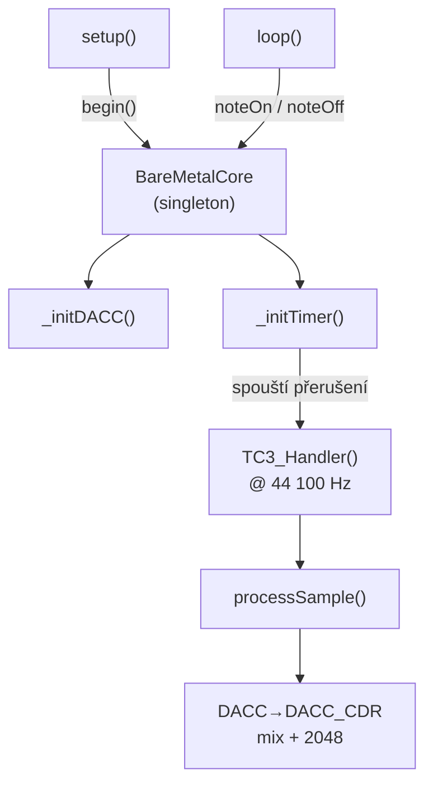
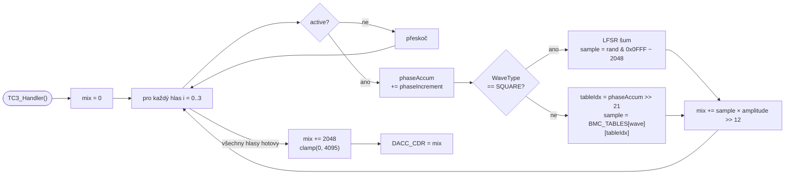

# Synthex

Vícehlasý wavetable syntezátor pro SAM3X8E, 84 MHz ARM Cortex-M3 (Arduino Due).
Zvuk je generován přímým čtením z Flash paměti bez kopírování do RAM, s výstupem přes 12-bit DAC na pinu **DAC1 (PA3)**.

---

## Obsah

- [Přehled architektury](#přehled-architektury)
- [Hardware](#hardware)
- [Parametry enginu](#parametry-enginu)
- [Wavetables](#wavetables)
- [Fázový akumulátor](#fázový-akumulátor)
- [Struktura projektu](#struktura-projektu)
- [API reference](#api-reference)
- [Rychlý start](#rychlý-start)
- [Diagnostika](#diagnostika)
- [Známé chování a limity](#známé-chování-a-limity)

---

## Přehled architektury

<<<<<<< HEAD

### Tok řízení



### Zpracování jednoho vzorku (processSample)



Syntezátor je řízen **přerušením časovače TC3** (TC1/CH0) s frekvencí přesně 44 100 Hz.
V každém přerušení se spočítá jeden vzorek za každý aktivní hlas, výsledky se smíchají a odešlou do DAC.

---

## Hardware

| Parametr             | Hodnota                     |
| -------------------- | --------------------------- |
| Procesor             | SAM3X8E (ARM Cortex-M3)     |
| Takt                 | 84 MHz                      |
| Deska                | Arduino Due                 |
| DAC výstup          | `DAC1` — pin PA3         |
| Rozlišení DAC      | 12 bit (0–4095)            |
| Výstupní kmitočet | 44 100 Hz                   |
| Časovač            | TC1 / Channel 0 → TC3_IRQn |
| Prescaler            | MCK/2 = 42 MHz → RC = 952  |

---

## Parametry enginu

Definovány v `Synthex.h`:

```cpp
#define SYNTHEX_SAMPLE_RATE     44100u  	 // vzorkovací kmitočet [Hz]
#define SYNTHEX_VOICES          4u 	  	   	 // počet simultánních hlasů
#define SYNTHEX_DAC_RESOLUTION  12u  	  	  // rozlišení DAC [bit]
#define SYNTHEX_DAC_MAX         4095u 	 	  // maximum DAC (2^12 - 1)
#define SYNTHEX_DAC_MID         2048u 	 	  // DC střed (ticho)
#define SYNTHEX_PHASE_SHIFT     21u   	 	  // (32 - 11), horních 11 bitů = index tabulky
```

---

## Wavetables

Tabulky jsou předgenerovány skriptem `generate_wavetables.py` a uloženy v `wavetables.h` jako `const int16_t[]` — tedy přímo ve **Flash paměti** (`.rodata`). Za běhu se nekopírují do RAM.

| Index | `WaveType`        | Popis                          | Min    | Max   |
| ----- | ------------------- | ------------------------------ | ------ | ----- |
| 0     | `SINE`            | Sinus                          | −2047 | +2047 |
| 1     | `SAW`             | Pilový průběh               | −2047 | +2045 |
| 2     | `SQUARE`          | ⚠ Viz poznámka níže        | −2047 | +2047 |
| 3     | `TRIANGLE`        | Trojúhelník                  | −2047 | +2047 |
| 4     | `BANDLIMITED_SAW` | Pilový průběh bez aliasingu | −2292 | +2292 |

Každá tabulka: **2048 vzorků × 2 B = 4 096 B**
Celkem: **5 × 4 096 B = 20 480 B = 20 KB Flash**

> **⚠ `WaveType::SQUARE`** — navzdory názvu a hodnotám v tabulce engine pro tento typ místo čtení z tabulky generuje **šum pomocí 32-bitového Galoisova LFSR**. Tabulka `BMC_TABLE_SQUARE` se za běhu nepoužívá. Pokud potřebuješ skutečný obdélník, přidej nový `WaveType` a uprav `processSample()`.

> **⚠ `BANDLIMITED_SAW`** — amplituda přesahuje 12-bit rozsah (peak ±2292). Po vynásobení amplitudou může dojít k ořezu v DAC výstupu. Při použití doporučujeme snížit `amplitude`.

---

## Fázový akumulátor

Syntéza tónu funguje na principu **Direct Digital Synthesis (DDS)**:

```
phaseIncrement = freqHz × (2^32 / sampleRate)
phaseAccum    += phaseIncrement   // přetečení = přirozené zarolování
tableIdx       = phaseAccum >> 21 // horních 11 bitů → 0–2047
```

Přepočet frekvence na inkrement (`freqToIncrement`):

```cpp
constexpr float k = (float)(1ULL << 32) / 44100.0f;  // ≈ 97 391.3
uint32_t inc = (uint32_t)(freqHz * k);
```

Příklady:

| Nota | Frekvence | phaseIncrement (approx.) |
| ---- | --------- | ------------------------ |
| A4   | 440 Hz    | 42 452 000               |
| C4   | 261 Hz    | 25 168 000               |
| A5   | 880 Hz    | 84 904 000               |

---

## Struktura projektu


```
.
├──lib
|     ├──Synthex
|     |	      ├──Synthex.h		# Hlavní třída enginu, struct Voice, konfigurace
|     |       └──Synthe.cpp		# Implementace: inicializace DAC/Timer, ISR, mix
|     └──millisTimer
|		   └── MillisTimer.h	# Jednoduchý timer bez blokování (předpokládán)
├──include
|	 └──wavetables.h		# Předgenerované tabulky (Flash), WaveType enum
└──src
     └──main.cpp			# Setup a loop — sekvencer, volání API

```

---

## API reference

### `Synthex` (singleton)

```cpp
Synthex& engine = Synthex::getInstance();
```

#### `begin()`

Inicializuje DAC a časovač. Volat jednou v `setup()`.

```cpp
engine.begin();
```

---

#### `noteOn(idx, freqHz, amplitude, wave)`

Spustí hlas `idx` s danou frekvencí, amplitudou a průběhem.

```cpp
engine.noteOn(
    0,               // index hlasu: 0–3
    440.0f,           // frekvence [Hz]
    100,             // amplituda: 0–4095 (pozor: 4095 = plná síla, může dojít ke clippingu při více hlasech)
    WaveType::SINE   // typ průběhu
);
```

> **Pozor na mix clipping:** součet všech aktivních hlasů se sčítá jako `int32_t` a teprve pak ořezává na 0–4095. Při 4 hlasech s amplitudou 4095 každý nutně dochází ke zkreslení. Doporučená bezpečná amplituda pro N hlasů: `4095 / N`.

---

#### `noteOff(idx)`

Zastaví hlas `idx`.

```cpp
engine.noteOff(0);
```

---

#### `getIsrCount()`

Vrátí celkový počet volání ISR od `begin()`. Slouží k ověření stability sample rate.

```cpp
uint32_t count = engine.getIsrCount();
// Očekáváno: count / (millis()/1000) ≈ 44100
```

---

#### `freqToIncrement(freqHz)` — statická

Převede frekvenci na hodnotu `phaseIncrement` (pro ruční manipulaci s hlasy).

```cpp
uint32_t inc = Synthex::freqToIncrement(880.0f);
```

---

### `WaveType` enum

```cpp
enum class WaveType : uint8_t {
    SINE            = 0,
    SAW             = 1,
    SQUARE          = 2,   // ⚠ Generuje šum (LFSR), ne obdélník!
    TRIANGLE        = 3,
    BANDLIMITED_SAW = 4,
    COUNT           = 5
};
```

---

## Rychlý start

```cpp
#include "Synthex.h"

Synthex& engine = Synthex::getInstance();

void setup() {
    engine.begin();

    // Spustit A4 jako sinus, hlas 0
    engine.noteOn(0, 440.0f, 512, WaveType::SINE);

    // Spustit C4 jako pila, hlas 1
    engine.noteOn(1, 261.0f, 512, WaveType::SAW);
}

void loop() {
    // Logika, sekvencer, ...
}
```

---

## Diagnostika

Pro ověření, zda timer běží na správné frekvenci, odkomentuj `diagTimer` blok v `main.cpp`:

```cpp
if (diagTimer.expired()) {
    uint32_t isr  = engine.getIsrCount();
    uint32_t nowS = millis() / 1000;
    Serial.print("ISR/s: ");
    Serial.println(nowS > 0 ? isr / nowS : 0);
    // Očekávána hodnota: ~44100
}
```

Výpočet RC pro timer (pro případ změny sample rate):

```
RC = (MCK / 2) / sampleRate
   = 42 000 000 / 44 100
   ≈ 952
```

Skutečná frekvence: `42 000 000 / 952 ≈ 44 117 Hz` (odchylka < 0,04 %).

---

## Známé chování a limity

| Téma                | Popis                                                                                                                      |
| -------------------- | -------------------------------------------------------------------------------------------------------------------------- |
| `WaveType::SQUARE` | Generuje šum (LFSR), ne obdélník. Tabulka se nepoužívá.                                                              |
| `BANDLIMITED_SAW`  | Přesahuje 12-bit rozsah — při plné amplitudě dochází k ořezu.                                                      |
| Thread safety        | `noteOn` / `noteOff` chrání kritické sekce pomocí `__disable_irq()` / `__enable_irq()`.                        |
| Amplituda            | `amplitude` v rozsahu 0–4095, ale součet hlasů není normalizován automaticky.                                       |
| Flash vs RAM         | Tabulky jsou v `.rodata` (Flash). Na AVR by bylo nutné `PROGMEM` + `pgm_read_word()`. Na SAM3X8E stačí `const`. |
| `MillisTimer`      | Předpokládá se vlastní implementace — není součástí tohoto repozitáře.                                          |

<style>#mermaid-1777663420754{font-family:sans-serif;font-size:16px;fill:#333;}#mermaid-1777663420754 .error-icon{fill:#552222;}#mermaid-1777663420754 .error-text{fill:#552222;stroke:#552222;}#mermaid-1777663420754 .edge-thickness-normal{stroke-width:2px;}#mermaid-1777663420754 .edge-thickness-thick{stroke-width:3.5px;}#mermaid-1777663420754 .edge-pattern-solid{stroke-dasharray:0;}#mermaid-1777663420754 .edge-pattern-dashed{stroke-dasharray:3;}#mermaid-1777663420754 .edge-pattern-dotted{stroke-dasharray:2;}#mermaid-1777663420754 .marker{fill:#333333;}#mermaid-1777663420754 .marker.cross{stroke:#333333;}#mermaid-1777663420754 svg{font-family:sans-serif;font-size:16px;}#mermaid-1777663420754 .label{font-family:sans-serif;color:#333;}#mermaid-1777663420754 .label text{fill:#333;}#mermaid-1777663420754 .node rect,#mermaid-1777663420754 .node circle,#mermaid-1777663420754 .node ellipse,#mermaid-1777663420754 .node polygon,#mermaid-1777663420754 .node path{fill:#ECECFF;stroke:#9370DB;stroke-width:1px;}#mermaid-1777663420754 .node .label{text-align:center;}#mermaid-1777663420754 .node.clickable{cursor:pointer;}#mermaid-1777663420754 .arrowheadPath{fill:#333333;}#mermaid-1777663420754 .edgePath .path{stroke:#333333;stroke-width:1.5px;}#mermaid-1777663420754 .flowchart-link{stroke:#333333;fill:none;}#mermaid-1777663420754 .edgeLabel{background-color:#e8e8e8;text-align:center;}#mermaid-1777663420754 .edgeLabel rect{opacity:0.5;background-color:#e8e8e8;fill:#e8e8e8;}#mermaid-1777663420754 .cluster rect{fill:#ffffde;stroke:#aaaa33;stroke-width:1px;}#mermaid-1777663420754 .cluster text{fill:#333;}#mermaid-1777663420754 div.mermaidTooltip{position:absolute;text-align:center;max-width:200px;padding:2px;font-family:sans-serif;font-size:12px;background:hsl(80,100%,96.2745098039%);border:1px solid #aaaa33;border-radius:2px;pointer-events:none;z-index:100;}#mermaid-1777663420754:root{--mermaid-font-family:sans-serif;}#mermaid-1777663420754:root{--mermaid-alt-font-family:sans-serif;}#mermaid-1777663420754 flowchart-v2{fill:apa;}</style>
